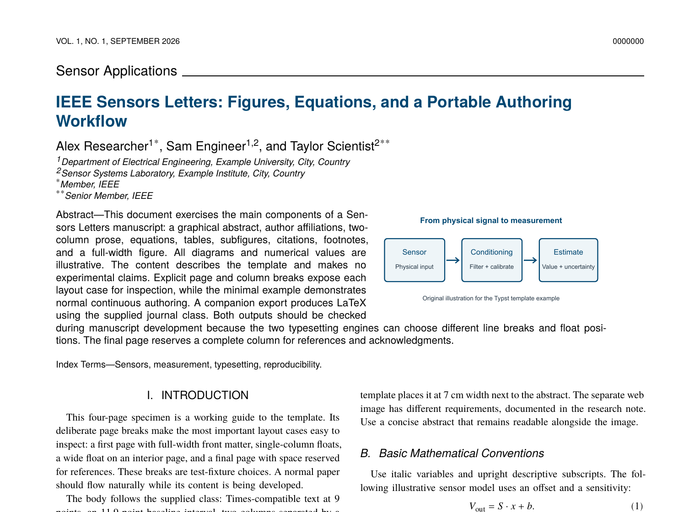

<h1 align="center">IEEE Sensors Letters for Typst</h1>

<p align="center">
  A polished authoring template for sensor research letters, with familiar IEEE-style typography and layout.
</p>

<p align="center">
  
  
  
</p>

<p align="center">
  
</p>

<p align="center"><sub>Actual first-page render from the included Typst showcase.</sub></p>

An independent Typst authoring template that follows the supplied IEEE Sensors
Letters author layout. This is an experimental `v0.1.0` release: it is not an
official IEEE template, and acceptance of Typst source by IEEE is not implied.

## Install as a local package

Typst discovers local packages at its package data directory. `typst info`
prints the effective package path; the usual version-specific destinations are:

| Platform | Clone destination |
|---|---|
| Windows | `%APPDATA%\typst\packages\local\ieee-sensors-letters\0.1.0` |
| macOS | `~/Library/Application Support/typst/packages/local/ieee-sensors-letters/0.1.0` |
| Linux | `${XDG_DATA_HOME:-~/.local/share}/typst/packages/local/ieee-sensors-letters/0.1.0` |

Clone the `v0.1.0` tag directly into that exact version directory. Typst has no
separate local-package installation command. The directory name and manifest
version must agree.

On Windows PowerShell:

```powershell
$destination = Join-Path $env:APPDATA "typst\packages\local\ieee-sensors-letters\0.1.0"
git clone --branch v0.1.0 --depth 1 https://github.com/Sauerbac/IEEE-Sensors-Letters.git $destination
```

On macOS:

```sh
git clone --branch v0.1.0 --depth 1 https://github.com/Sauerbac/IEEE-Sensors-Letters.git \
  "$HOME/Library/Application Support/typst/packages/local/ieee-sensors-letters/0.1.0"
```

On Linux:

```sh
git clone --branch v0.1.0 --depth 1 https://github.com/Sauerbac/IEEE-Sensors-Letters.git \
  "${XDG_DATA_HOME:-$HOME/.local/share}/typst/packages/local/ieee-sensors-letters/0.1.0"
```

Create a manuscript from the starter:

```console
typst init @local/ieee-sensors-letters:0.1.0 my-paper
```

Or import the package directly:

```typst
#import "@local/ieee-sensors-letters:0.1.0": *

#show: lsens.with(
  title: [Your Paper Title],
  authors: ((name: "Alex Researcher", affiliations: (1,)),),
  affiliations: ([Your affiliation],),
  abstract: [Your abstract.],
  graphical-abstract: image("assets/graphical-abstract.svg", width: 7cm),
  keywords: ("Sensors", "measurement"),
)
```

## Fonts

Exact layout depends on TeX Gyre Termes, TeX Gyre Heros, and TeX Gyre Termes
Math. Their OpenType files and license are included in `fonts/`. Install the
fonts on your system for editor previews, or pass the directory explicitly:

```console
typst compile --font-path /path/to/ieee-sensors-letters/0.1.0/fonts main.typ
```

## Examples

- `template/` is the compact starter copied by `typst init`.
- `examples/acoustic-monitoring.typ` is a fictional paper using deterministic
  synthetic results and original vector figures. It demonstrates the richer
  layout without making scientific claims.

Compile the showcase from the repository root after installing the package:

```console
typst compile --root . --font-path fonts examples/acoustic-monitoring.typ acoustic-monitoring.pdf
```

## Scope and status

Version `0.1.0` targets Typst 0.15 and supports regular letters, viewpoints,
and editorials. Authors remain responsible for checking current journal rules,
page limits, metadata, accessibility, and accepted submission formats. The
project is maintained on a best-effort basis without a response-time promise.

See [NOTICE.md](NOTICE.md) for independence and third-party notices. Original
project material is available under the [MIT License](LICENSE).
